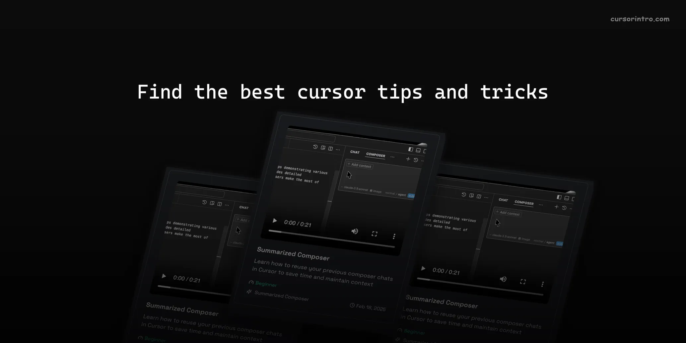

# Cursor Intro Tips


A collection of tips, tricks, and best practices for using Cursor - the world's best AI-powered IDE.
Read our [Contributing Guidelines](CONTRIBUTING.md).

## Overview

This repository contains a curated collection of tips demonstrating various features and capabilities of Cursor. Each tip includes detailed explanations, examples, and media content to help users make the most of Cursor's features.

## Features

- 📝 Markdown-based tip collection
- 🎥 Video demonstrations
- 📸 Screenshots and visual guides
- 🐦 Twitter integration
- 🏷️ Categorized content
- 📊 Difficulty levels for all user types

## Contributing

We welcome contributions from the community! If you have a tip to share:

1. Read our [Contributing Guidelines](CONTRIBUTING.md)
2. Fork the repository
3. Create your tip following the template
4. Submit a Pull Request

## Getting Started

1. Clone the repository

```bash
git clone https://github.com/yourusername/cursor-intro.git
cd cursor-intro
```

2. Install dependencies

```bash
npm install
```

3. Run the development server

```bash
npm run dev
```

## Categories

Tips are organized into various categories to help users find relevant content. Check the `/config/categories.json` file for the complete list of categories.
